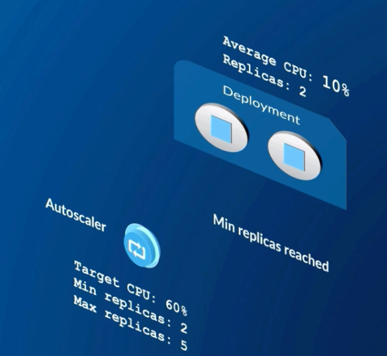

## Auto-Scaling

- Scale automatically based on CPU utilisation (or custom metrics)
- Set target CPU along with min and max replicas
- Target CPU is expressed as a percentage of the Pod's CPU request



### Metrics

- Autoscaling depends on metrics being collected
- Metric server is one solution for collecting metrics. We're going to be using the Metrics Server which is a solution that is maintained by Kubernetes itself.
    - Kubernetes integrates with several solutions for collecting metrics. 
- Several manifest files are used to deploy Metrics Server


**6.1-app_tier_api_request.yaml**
```
apiVersion: v1
kind: Service
metadata:
  name: app-tier
  labels:
    app: microservices
spec:
  ports:
  - port: 8080
  selector:
    tier: app
---
apiVersion: apps/v1
kind: Deployment
metadata:
  name: app-tier
  labels:
    app: microservices
    tier: app
spec:
  replicas: 5
  selector:
    matchLabels:
      tier: app
  template:
    metadata:
      labels:
        app: microservices
        tier: app
    spec:
      containers:
      - name: server
        image: lrakai/microservices:server-v1
        imagePullPolicy: Always
        ports:
          - containerPort: 8080
        resources:
          requests:
            cpu: 20m
        env:
          - name: REDIS_URL
            # Environment variable service discovery
            # Naming pattern:
            #   IP address: <all_caps_service_name>_SERVICE_HOST
            #   Port: <all_caps_service_name>_SERVICE_PORT
            #   Named Port: <all_caps_service_name>_SERVICE_PORT_<all_caps_port_name>
            value: redis://$(DATA_TIER_SERVICE_HOST):$(DATA_TIER_SERVICE_PORT_REDIS)
            # In multi-container example value was
            # value: redis://localhost:6379 
```
In the above file I have added the resource request for the app server and have increment the number of replicas to 5.l. 

If we try to create the above app_tier, the deployment will fail if it already exists within the same namespace. In this case we can use the apply command (example below).

```
> kubectl get pods -n dp-5
NAME                            READY   STATUS    RESTARTS   AGE
app-tier-7966fb64bd-f2jzg       1/1     Running   0          102s
app-tier-7966fb64bd-jrzpz       1/1     Running   0          103s
app-tier-7966fb64bd-kvvzr       1/1     Running   0          106s
app-tier-7966fb64bd-q9gdv       1/1     Running   0          106s
app-tier-7966fb64bd-rpl96       1/1     Running   0          106s
data-tier-56ccc86884-2wqps      1/1     Running   0          12m
support-tier-6d8d778f5b-vngtf   2/2     Running   0          12m

> kubectl get deployments -n dp-5                                                       
NAME           READY   UP-TO-DATE   AVAILABLE   AGE
app-tier       5/5     5            5           12m
data-tier      1/1     1            1           12m
support-tier   1/1     1            1           12m
```

We can see the number of pods increased from 1 to 5 for the app-tier after applying the above changes. Now lets create the horizontal scaler. 

**6.2-autoscale**
```
apiVersion: autoscaling/v1
kind: HorizontalPodAutoscaler
metadata:
  name: app-tier
  labels:
    app: microservices
    tier: app
spec:
  maxReplicas: 5
  minReplicas: 1
  scaleTargetRef:
    apiVersion: apps/v1
    kind: Deployment
    name: app-tier
  targetCPUUtilizationPercentage: 70
```

The number of pods reduced to 1 after a few minutes. 

```
> kubectl get hpa -n dp-5
NAME       REFERENCE             TARGETS        MINPODS   MAXPODS   REPLICAS   AGE
app-tier   Deployment/app-tier   cpu: 40%/70%   1         5         1          6m27s

> kubectl describe hpa app-tier -n dp-5
Name:                                                  app-tier
Namespace:                                             dp-5
Labels:                                                app=microservices
                                                       tier=app
Annotations:                                           <none>
CreationTimestamp:                                     Wed, 13 Nov 2024 22:00:04 +0000
Reference:                                             Deployment/app-tier
Metrics:                                               ( current / target )
  resource cpu on pods  (as a percentage of request):  15% (3m) / 70%
Min replicas:                                          1
Max replicas:                                          5
Deployment pods:                                       1 current / 1 desired
Conditions:
  Type            Status  Reason              Message
  ----            ------  ------              -------
  AbleToScale     True    ReadyForNewScale    recommended size matches current size
  ScalingActive   True    ValidMetricFound    the HPA was able to successfully calculate a replica count from cpu resource utilization (percentage of request)
  ScalingLimited  False   DesiredWithinRange  the desired count is within the acceptable range
Events:
  Type     Reason                        Age    From                       Message
  ----     ------                        ----   ----                       -------
  Warning  FailedGetResourceMetric       9m31s  horizontal-pod-autoscaler  failed to get cpu utilization: unable to get metrics for resource cpu: no metrics returned from resource metrics API
  Warning  FailedComputeMetricsReplicas  9m31s  horizontal-pod-autoscaler  invalid metrics (1 invalid out of 1), first error is: failed to get cpu resource metric value: failed to get cpu utilization: unable to get metrics for resource cpu: no metrics returned from resource metrics API
  Warning  FailedGetResourceMetric       9m16s  horizontal-pod-autoscaler  failed to get cpu utilization: did not receive metrics for targeted pods (pods might be unready)
  Warning  FailedComputeMetricsReplicas  9m16s  horizontal-pod-autoscaler  invalid metrics (1 invalid out of 1), first error is: failed to get cpu resource metric value: failed to get cpu utilization: did not receive metrics for targeted pods (pods might be unready)
  Normal   SuccessfulRescale             7m15s  horizontal-pod-autoscaler  New size: 1; reason: All metrics below target
```

We can also edit the live auto-scaling configuration and update fields or parameters using the below command

`kubectl edit hba -n dp-5`

After increasing the min replicas direclty from the terminal, the number of pods increased.

```
kubectl describe hpa app-tier -n dp-5
Name:                                                  app-tier
Namespace:                                             dp-5
Labels:                                                app=microservices
                                                       tier=app
Annotations:                                           <none>
CreationTimestamp:                                     Wed, 13 Nov 2024 22:00:04 +0000
Reference:                                             Deployment/app-tier
Metrics:                                               ( current / target )
  resource cpu on pods  (as a percentage of request):  15% (3m) / 70%
Min replicas:                                          2
Max replicas:                                          5
Deployment pods:                                       2 current / 2 desired
Conditions:
  Type            Status  Reason              Message
  ----            ------  ------              -------
  AbleToScale     True    ReadyForNewScale    recommended size matches current size
  ScalingActive   True    ValidMetricFound    the HPA was able to successfully calculate a replica count from cpu resource utilization (percentage of request)
  ScalingLimited  False   DesiredWithinRange  the desired count is within the acceptable range
Events:
  Type     Reason                        Age   From                       Message
  ----     ------                        ----  ----                       -------
  Warning  FailedGetResourceMetric       14m   horizontal-pod-autoscaler  failed to get cpu utilization: unable to get metrics for resource cpu: no metrics returned from resource metrics API
  Warning  FailedComputeMetricsReplicas  14m   horizontal-pod-autoscaler  invalid metrics (1 invalid out of 1), first error is: failed to get cpu resource metric value: failed to get cpu utilization: unable to get metrics for resource cpu: no metrics returned from resource metrics API
  Warning  FailedGetResourceMetric       14m   horizontal-pod-autoscaler  failed to get cpu utilization: did not receive metrics for targeted pods (pods might be unready)
  Warning  FailedComputeMetricsReplicas  14m   horizontal-pod-autoscaler  invalid metrics (1 invalid out of 1), first error is: failed to get cpu resource metric value: failed to get cpu utilization: did not receive metrics for targeted pods (pods might be unready)
  Normal   SuccessfulRescale             12m   horizontal-pod-autoscaler  New size: 1; reason: All metrics below target
  Normal   SuccessfulRescale             18s   horizontal-pod-autoscaler  New size: 2; reason: Current number of replicas below Spec.MinReplicas
```


### Kubernetes Commands

#### To Apply or Create multiple resources within a specific folder**

`kubectl apply -f <folder_name>/`

#### To check the CPU and memory utilisation for all the pods under a namespace
`kubectl top pods -n <namespace>`  
##### Example
```
kubectl top pods -n dp-5
NAME                           CPU(cores)   MEMORY(bytes)   
app-tier-64b6d9d9f7-8whmz      3m           43Mi            
data-tier-56ccc86884-5q2d9     5m           3Mi             
support-tier-8cb64954b-mwdlh   22m          0Mi 
```

#### To update existing resources or create multiple resources within a specific folder

`kubectl apply -f <folder_name>/`

#### To get all the horizontal autoscaler
`kubectl get hpa -n <namespace>`

#### To check all the possible resources type in Kubernetes
`kubectl api-resources` 

#### To update an existing auto-scaler
`kubectl edit hba -n <namespace>`