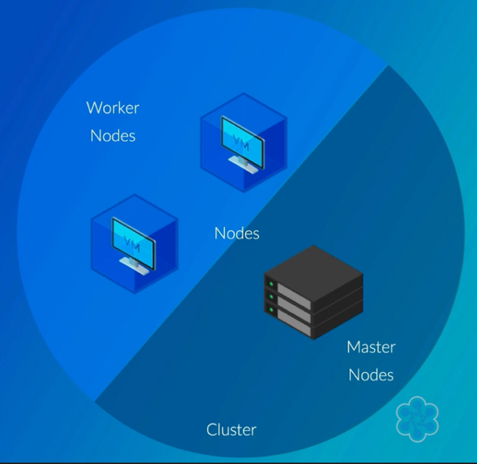
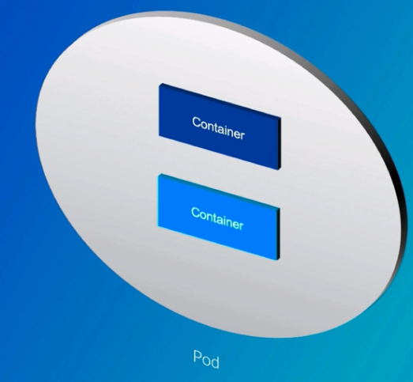
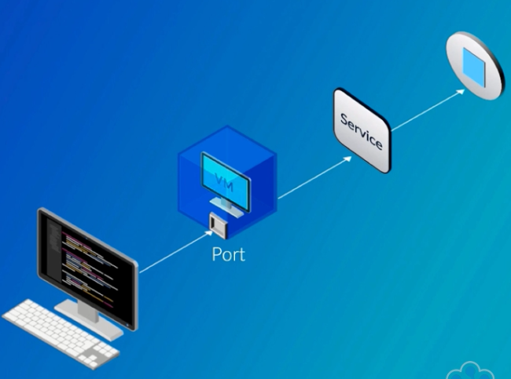
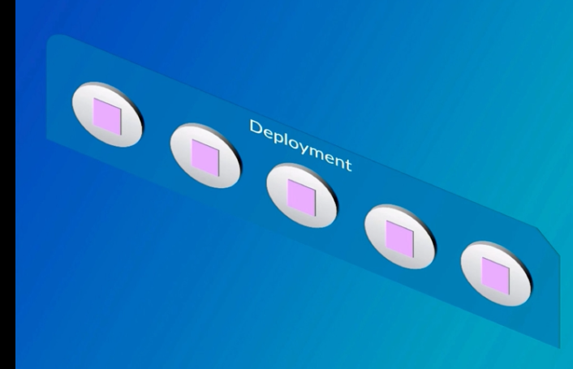

## Kubernetes Basics

### Overview
Kubernetes provides tool case to productionise applications. It is an open-source container orchestration tool designed to automate, deploying, scaling and operating containerised applications. 
- It was born out of Google's experience running production workloads at scale
- Allows organisations to increase their velocity by releasing and recovering faster

__More about Kubernetes__  
- Distributed system - machine may be physical, virtual, on-prem or in the cloud.
- Schedules containers on machines
- Moves containers as machines are added or removed
- Can use different container runtimes
- Modular, extensible design (Most commonly used Docker but others can be used as well)

__Using Kubernetes__
- Declarative configurations
- Deploy containers
- Wire up networking
- Scale and expose services

__Kubernetes for Operations__
- Automatically recover from machine failures
- Built-in support for machine maintenance
- Join clusters with federation (If one cluster dies, it will be automatically move to a different cluster)

__Kubernetes Highlights__
- Automated deployment rollout and rollback
- Seamless horizontal scaling
- Secret management
- Service discovery and load balancing
- Linux and Windows container support
- Simple log collection
- Role-based access control
- Batch job processing
- CPU and memory quotas
- Persistent volume management
- Stateful application support

### Deploying Kubernetes

#### Single Node Kubernetes Clusters
For running single node clusters we can use the below tools. 
- Docker 
- Minikube
- Kubeadm

#### Multi-Node Kubernetes Clusters
- For your production workloads
- Horizontal scaling
- Tolerate node failures
- Control vs effort in maintaining the clusters?
  - Fully-managed solutions
    - EKS
    - AKS (Azure)
    - GKE (Google)
  - Full-control
    - Kubespray
    - Kobs
    - Kubadm
- On prem or in the cloud?
- Linux, Windows or both containers?
  - To support linux containers you need linux nodes in your cluster
  - To support windows containers, you will need windows nodes in your cluster
  - Both linux and windows node can exist in the same cluster

### Kubernetes Architecture
- Cluster refers to all of the machines collectively and can be thought of as the entire running system. Its a collection of all the machines running in the ecosystem or for a specific use-case. 
- Nodes are the machines in the cluster. They could be standalone CPU or it could be a Virtual Machine.
- Nodes are categorised as Master and Worker nodes
- Worker nodes include software to run container workloads managed by the Kubernetes control plane. It is the node that runs the actual workload and contains all necessary softwares.
- Master nodes run the control plane
- The control plane is a set of APIs and software that Kubernetes users interact with

#### Scheduling
- Control plane schedules containers onto nodes (How?)
- Scheduling decisions consider required CPU and other factors (Memory?)
- Scheduling refers to the decision process of placing containers onto node

#### Kubernetes Pods
- Group of containers - they all run on the same node
- Pods are the smallest building block in Kubernetes
- More complex and useful abstractions built on top of Pods

#### Kubernetes Services
- Services define networking rules for exposing group of pods
  - Either to other pods or to the internet

#### Kubernetes Deployment
- Manages the deploying configurations changes to running pods
- Horizontal scaling

### Interacting with Kubernetes

---

- Modify cluster state information by sending requests to the Kubernetes API server
- The API Server is the master component that acts as the frontend for the cluster

**Method 1: Rest APIs**

- It is possible but not common to work directly with the API server
- You might need to if there is no Kubernetes client library for your programming language

**Method 2: Client Library**

- Handles authenticating and managing individual REST API requests and responses
- Kubernetes maintains official client libraries: Python and Go

**Method 3: Kubectl**

- Issue high-level terminal command that are translated into REST API calls
- Works with local and remote clusters
- Manages all different types of Kubernetes resources and provides debugging and introspection features
- Kubectl commands follow an easy to understand pattern

- `kubectl create` - to create resources (Pods, Services, etc)
- `kubectl delete` - to delete resources
- `kubectl get` - to get list of resources of a given type
    - `kubectl get pods`
- `kubectl describe` - to print detailed info about a resource(s)
    - `kubectl describe pod server`
- `kubectl logs` - to print container logs